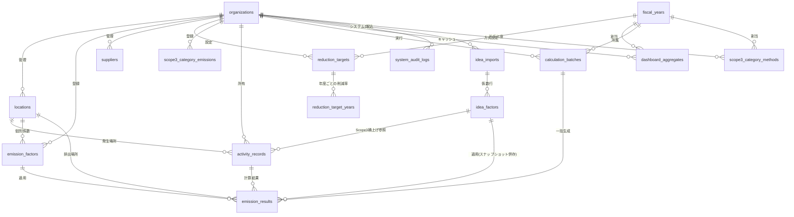

# OpenGreenTrack データベース設計仕様書

本書は、温室効果ガス（GHG）排出量算定・可視化ツール「OpenGreenTrack」におけるデータベース（PostgreSQL）の物理設計、リレーションシップ、および各エンティティのデータ定義をまとめた設計書である。

---

## 1. 全体エンティティ関連図 (ERD)



---

## 2. 設計ポリシー & セキュリティ・プライバシー対策

### 2.1 セキュリティ・プライバシー対策 (強化)

OpenGreenTrackは、機密性の高い企業の活動量データを取り扱うため、設計段階から以下のセキュリティ対策をデータベースレイヤーにおいて組み込んでいる。

1. **APIキーの非平文保存 (ハッシュ化保護)**
   - `organizations` テーブルの `apiKeyHash` フィールドには、平文のAPIキーではなく **SHA-256等の暗号ハッシュ化された値** を保存する。
   - 万が一データベースが外部に流出した場合でも、攻撃者が他社のAPIキーを利用して不正アクセスする二次被害を防ぐ。

2. **マルチテナント分離の担保 (テナントRLS設計)**
   - すべてのテーブルは `organizationId` （組織ID）を保有する。
   - PostgreSQLの **RLS（Row Level Security / 行レベルセキュリティ）** 機能を有効化し、データベース接続ユーザーが保有するロール/テナントコンテキスト以外の行に対する `SELECT`, `INSERT`, `UPDATE`, `DELETE` をエンジンレベルで遮断する。

3. **厳格な監査証跡 (Audit Trail)**
   - `locations` (拠点マスタ) および `activity_records` (活動量レコード) に、`createdByUserId` および `updatedByUserId` を追加。データ操作者を常に追跡できる。
   - 個人情報やデータの改ざん、あるいは重要な設定変更操作を完全に記録するための `system_audit_logs` (システム操作ログ) テーブルを別途設置。

4. **算定結果の書き込み経路の一本化**
   - 算定結果テーブル（`emission_results` / `calculation_batches` / `dashboard_aggregates`）は `authenticated` には **SELECT のみ**。INSERT / UPDATE / DELETE の GRANT とポリシーを持たない（`supabase/migrations/20260831000001_rls.sql` §3・§4.2）。
   - 書き込みは service_role 限定の RPC（`run_calculation_commit` / `create_calculation_batch_with_rate_limit` / `refresh_dashboard_aggregates`）だけを通る。組織スコープの RLS だけでは、PostgREST を直接叩いて算定エンジン・レート制限・監査ログを迂回した報告値の書き換えを防げないため。
   - 活動量・拠点の削除に伴う結果行の後始末は on delete cascade と security definer トリガーが行うため、この権限剥奪の影響を受けない。

### 2.2 小数点精度の厳格化 (Decimal型)
浮動小数点による計算誤差を防ぐため、数値データには `Decimal` 型を使用する。
- **活動量 (`ActivityRecord.amount`)**: `Decimal(15, 3)` (整数部12桁、小数部3桁)。大容量の使用量に対応。
- **排出係数 (`EmissionFactor.factorValue`)**: `Decimal(12, 6)` (整数部6桁、小数部6桁)。環境省などの微細な係数値に対応。
- **排出量 (`EmissionResult.emissions`)**: `Decimal(15, 6)` (整数部9桁、小数部6桁 - t-CO2e)。
  Scope3 積上げ算定（IDEA連携）で小口明細のレコード単位 1kg 丸めが系統的過小計上になるため、
  1g 粒度（10^-6 t）としている（`supabase/migrations/20260831000000_schema.sql` の `emission_results.emissions`、
  `idea-scope3-spec.md §3.4`）。
  **`dashboard_aggregates` の scope1/2/3Total と `scope3_category_emissions.emissions` は
  `Decimal(15, 3)` のまま意図的に据え置く**（合計値の 1kg 丸めは実用上無害。広げないこと）。
- **IDEA 係数 (`idea_factors.gwpValue` / `baseFlowAmount`)**: 無制約 `numeric`。IDEA の有効桁
  （円単位原単位は t-CO2e 換算で 1e-9 オーダー）を桁落ちなく原典精度のまま保持する。

### 2.3 安全な削除・整合性制御 (On Delete)
- **連鎖削除 (Cascade)**: `Organization` または `Location` が削除された際、紐づく活動量データや算定結果は連鎖的に自動削除される。
- **保護・Null設定 (SetNull / Protect)**: `EmissionFactor`（排出係数）が削除された場合、過去の算定結果 (`EmissionResult`) の履歴を残すために、係数参照IDは削除されずに `NULL` がセットされる。

---

## 3. テーブル定義詳細

### 3.1 組織マスタ (`organizations`)
マルチテナント（複数企業）対応のための基本テーブル。

| 物理名 | 論理名 | 型 | 制約 | 説明 |
| :--- | :--- | :--- | :--- | :--- |
| `id` | 組織ID | UUID | Primary Key | 自動生成 (UUID) |
| `name` | 組織名 | VARCHAR(200) | NOT NULL | 企業・団体名 |
| `apiKeyHash` | APIキーハッシュ | VARCHAR(255) | UNIQUE, NOT NULL | API認証用キーの暗号化ハッシュ値。`authenticated` には列 GRANT で晒さない |
| `corporateNumber` | 法人番号 | VARCHAR(13) | NULL | |
| `industrySector` | 業種 | VARCHAR(100) | NULL | |
| `address` | 所在地 | VARCHAR(255) | NULL | |
| `envManagerName` | 環境管理責任者名 | VARCHAR(100) | NULL | |
| `fiscalYearStartMonth` | 期首月 | SMALLINT | NULL, CHECK 1〜12 | 算定年度の開始月。NULL は 4 月始まり扱い（機能仕様 §1.2） |
| `createdAt` | 作成日時 | TIMESTAMPTZ | NOT NULL, DEFAULT | |
| `updatedAt` | 更新日時 | TIMESTAMPTZ | NOT NULL | |

### 3.2 算定年度 (`fiscal_years`)
環境情報開示で基準となる年度管理用のテーブル。

| 物理名 | 論理名 | 型 | 制約 | 説明 |
| :--- | :--- | :--- | :--- | :--- |
| `id` | 算定年度ID | UUID | Primary Key | |
| `organizationId` | 組織ID | UUID | Foreign Key | 削除時: CASCADE。年度は組織別（期首月が組織ごとの設定のため） |
| `label` | 年度ラベル | VARCHAR(50) | NOT NULL | 例: "2024年度" |
| `startDate` | 開始日 | DATE | NOT NULL | 例: 2024-04-01 |
| `endDate` | 終了日 | DATE | NOT NULL | 例: 2025-03-31 |
| `createdAt` | 作成日時 | TIMESTAMPTZ | NOT NULL, DEFAULT | |

### 3.3 拠点マスタ (`locations`)
二酸化炭素の排出元となる施設・オフィスなどを管理する。

| 物理名 | 論理名 | 型 | 制約 | 説明 |
| :--- | :--- | :--- | :--- | :--- |
| `id` | 拠点ID | UUID | Primary Key | |
| `organizationId` | 組織ID | UUID | Foreign Key | 削除時: CASCADE |
| `name` | 拠点名 | VARCHAR(100) | NOT NULL | 例: "東京本社", "名古屋工場" |
| `region` | 地域 | ENUM | NOT NULL | 電力係数の適用判別用 (Region Enum) |
| `type` | 拠点種別 | ENUM | NOT NULL | グラフ等の構成比分析用 (LocationType Enum) |
| `managerName` | 責任者名 | VARCHAR(100) | NULL | 拠点責任者の名前 |
| `managerUserId` | 責任者ユーザーID | UUID | NULL | **未使用**。アプリは読み書きしない |
| `scopes` | 集計Scope | Scope[] (配列) | NOT NULL, DEFAULT `'{}'` | **未使用**。画面・CSV・算定のどこからも参照しない。列は据え置きだがアプリは読み書きしない |
| `status` | 拠点状態 | ENUM | NOT NULL, DEFAULT | LocationStatus Enum (preparing等) |
| `prefecture` | 都道府県 | VARCHAR(50) | NULL | **未使用**。アプリは読み書きしない |
| `address` | 住所 | VARCHAR(255) | NULL | **未使用**。アプリは読み書きしない |
| `isAggregationTarget` | 集計対象 | BOOLEAN | NOT NULL, DEFAULT true | **未使用**。集計は全拠点を対象にし、この列は参照しない |
| `createdByUserId` | 登録操作者ID | UUID | NULL | 監査用: データ登録したユーザーID |
| `updatedByUserId` | 更新操作者ID | UUID | NULL | 監査用: 最後にデータ更新したユーザーID |

### 3.4 排出係数マスタ (`emission_factors`)
GHG排出量の計算に用いる原単位係数。公式係数（`organizationId` が null・`isCustom=false`。全組織共通の読み取り専用）の
初期データは `supabase/seeds/production/official_emission_factors.sql`（`scripts/official-factors/generate.ts` が生成）で
投入する。マイグレーション（`supabase/migrations/`）は DDL 専用でデータを含めない（`AGENTS.md` R12）。

| 物理名 | 論理名 | 型 | 制約 | 説明 |
| :--- | :--- | :--- | :--- | :--- |
| `id` | 係数ID | UUID | Primary Key | |
| `organizationId` | 組織ID | UUID | Foreign Key | 削除時: CASCADE |
| `name` | 係数名称 | VARCHAR(200) | NOT NULL | 例: "東京電力 調整後排出係数 (2024)" |
| `energyType` | エネルギー種別 | ENUM | NOT NULL | EnergyType Enum (electricity等) |
| `scope` | 該当Scope | ENUM | NOT NULL | Scope 1 / 2 / 3 |
| `factorValue` | 係数値 | DECIMAL(12, 6) | NOT NULL | 例: 0.000441 (t-CO2e/kWh) |
| `unit` | 単位 | VARCHAR(50) | NOT NULL | 例: "t-CO2e/kWh", "t-CO2e/m3" |
| `applicableYear` | 適用年度 | INT | NOT NULL | 適用する暦年または年度 (例: 2024) |
| `regionName` | 適用地域名 | VARCHAR(100) | NOT NULL | 例: "全国", "東京電力管内" |
| `source` | 係数ソース | ENUM | NOT NULL | FactorSource Enum (moe=環境省等) |
| `status` | 係数状態 | ENUM | NOT NULL | FactorStatus Enum (active=有効等) |
| `isCustom` | カスタムフラグ | BOOLEAN | NOT NULL, DEFAULT | 自社定義係数の場合は true |
| `locationId` | 適用拠点ID | UUID | Foreign Key | 拠点固有係数にする場合指定 (SetNull) |
| `supplierId` | 適用サプライヤーID | UUID | Foreign Key | サプライヤー固有係数にする場合指定 (SetNull) |

### 3.5 活動量レコード (`activity_records`)
電気の使用量やガスの使用量などの、算定元データ（ファクトデータ）。

| 物理名 | 論理名 | 型 | 制約 | 説明 |
| :--- | :--- | :--- | :--- | :--- |
| `id` | レコードID | UUID | Primary Key | |
| `organizationId` | 組織ID | UUID | Foreign Key | 削除時: CASCADE |
| `locationId` | 拠点ID | UUID | Foreign Key | 削除時: CASCADE |
| `sourceType` | データソース | ENUM | NOT NULL | SourceType Enum (manual) |
| `energyType` | エネルギー種別 | ENUM | NOT NULL | electricity / city_gas 等 |
| `amount` | 使用活動量 | DECIMAL(15, 3) | NOT NULL | 例: 24500.500 |
| `unit` | 活動量単位 | VARCHAR(50) | NOT NULL | 例: "kWh", "m3" |
| `periodStart` | 対象期間（開始） | DATE | NOT NULL | 例: 2024-04-01 |
| `periodEnd` | 対象期間（終了） | DATE | NOT NULL | 例: 2024-04-30 |
| `isCalculated` | 算定済みフラグ | BOOLEAN | NOT NULL, DEFAULT | 算定処理が走ったかどうかを追跡 |
| `scope3CategoryId` | Scope3カテゴリID | INT | NULL, CHECK(1..15) | Scope3積上げレコード（`energyType='scope3_activity'`）のみ必須（CHECK制約） |
| `ideaFactorId` | IDEA係数ID | UUID | Foreign Key | Scope3積上げレコードの参照係数 (SetNull。null は「参照切れ」＝製品の再選択が必要) |
| `createdByUserId` | 登録操作者ID | UUID | NULL | 監査用: データ登録したユーザーID |
| `updatedByUserId` | 更新操作者ID | UUID | NULL | 監査用: 最後にデータ更新したユーザーID |

### 3.6 システム操作ログ (`system_audit_logs`)
法令に基づく第三者保証やセキュリティ監査に対応するため、誰がいつどのようなシステム変更・データ参照をしたかをログとして永続化する。

| 物理名 | 論理名 | 型 | 制約 | 説明 |
| :--- | :--- | :--- | :--- | :--- |
| `id` | ログID | UUID | Primary Key | |
| `organizationId` | 組織ID | UUID | Foreign Key | 削除時: CASCADE |
| `userId` | 操作ユーザーID | UUID | NOT NULL | 操作を行ったユーザーのアカウントID |
| `action` | 操作アクション | VARCHAR(100) | NOT NULL | 操作内容 (例: "delete_activity_record") |
| `entityName` | 対象テーブル名 | VARCHAR(100) | NOT NULL | 影響を受けたテーブル (例: "activity_records") |
| `entityId` | 対象レコードID | UUID | NULL | 変更対象のデータUUID |
| `detail` | 変更詳細 | TEXT | NULL | 変更前のJSONスナップショットなどを保存 |
| `ipAddress` | 接続元IP | VARCHAR(45) | NULL | 接続元のIPv4またはIPv6アドレス |
| `createdAt` | 記録日時 | TIMESTAMPTZ | NOT NULL, DEFAULT | |

### 3.7 IDEAインポート記録 (`idea_imports`) — Scope3積上げ算定（`supabase/migrations/20260831000000_schema.sql` の `idea_imports`）
IDEA（AIST LCIデータベース）Excel の取込単位。BYOライセンス方式のため**組織スコープ必須**で、
グループ会社にも共有しない（RLS は `current_user_organization_id()` の自組織のみ。書き込みは
Route Handler + service_role 限定）。詳細な確定 DDL は `idea-scope3-spec.md §3` を正とする。

| 物理名 | 論理名 | 型 | 制約 | 説明 |
| :--- | :--- | :--- | :--- | :--- |
| `id` | インポートID | UUID | Primary Key | |
| `organizationId` | 組織ID | UUID | Foreign Key | 削除時: CASCADE。ライセンスは法人単位 |
| `version` | 版名 | VARCHAR(100) | NOT NULL | 例: 'Ver.4.0 標準版' |
| `releaseDate` | リリース日 | DATE | NULL | |
| `gwpModel` | GWPモデル列識別子 | VARCHAR(200) | NOT NULL | 例: '気候変動 IPCC 2021 GWP 100a without LULUCF'。レポート出典欄に表示 |
| `citationText` | 引用表記 | TEXT | NOT NULL | 取込時に自動生成。レポート出典欄に表示 |
| `fileName` | ファイル名 | VARCHAR(300) | NOT NULL | |
| `status` | 取込状態 | ENUM | NOT NULL, DEFAULT | IdeaImportStatus (processing/completed/failed) |
| `rowCount` | 取込行数 | INT | NOT NULL, DEFAULT | |
| `isActive` | 有効フラグ | BOOLEAN | NOT NULL, DEFAULT false | 検索・新規紐付けの対象。組織内で true は最大1件（部分一意インデックス） |
| `unmappedRecordCount` | 再選択必要件数 | INT | NOT NULL, DEFAULT | 版更新で新版に同一コードが無かった未算定明細の件数 |
| `skippedRowCount` | 取込対象外件数 | INT | NOT NULL, DEFAULT | GWP値が空欄で取込対象外にした行数（LCIA結果を持たない製品。エラーではない。`supabase/migrations/20260831000000_schema.sql` の `comment on column idea_imports."skippedRowCount"` 参照） |
| `errorMessage` | エラー内容 | TEXT | NULL | |

### 3.8 IDEA係数 (`idea_factors`)
取込済みの IDEA 製品別係数（1インポートあたり約1万行）。既存の `emission_factors` とは分離し
（精度・規模・ライセンス境界の理由。仕様書 §2 案B）、**係数CSVエクスポートの対象外**とする。

| 物理名 | 論理名 | 型 | 制約 | 説明 |
| :--- | :--- | :--- | :--- | :--- |
| `id` | 係数ID | UUID | Primary Key | |
| `organizationId` | 組織ID | UUID | Foreign Key | RLS用に非正規化 (CASCADE) |
| `importId` | インポートID | UUID | Foreign Key | 削除時: CASCADE。UNIQUE(importId, ideaCode) |
| `ideaCode` | IDEA製品コード | VARCHAR(30) | NOT NULL | 例 '999999999mJPN'（国コード含み一意） |
| `productName` | 製品名 | VARCHAR(300) | NOT NULL | |
| `country` | 国 | VARCHAR(10) | NOT NULL | 'JPN' / 'GLO' 等 |
| `dbType` | DB区分 | VARCHAR(20) | NOT NULL | 'CORE' / 'GLO' 等 |
| `baseFlowAmount` | 基準フロー量 | NUMERIC | NOT NULL, DEFAULT 1 | |
| `gwpValue` | GWP係数値 | NUMERIC | NOT NULL | kg-CO2e/単位。無制約 numeric で原典精度を保持 |
| `unit` | 単位 | VARCHAR(30) | NOT NULL | kg / kWh / 円 / t-km 等 |

### 3.9 Scope3カテゴリ算定方法 (`scope3_category_methods`)
カテゴリ 1〜15 × 年度ごとの算定方法（direct = 直接入力 / calculated = 積上げ算定）。
**行が無いカテゴリ×年度の既定は `direct`**（後方互換）。方式の排他選択により direct 値と
積上げ値の二重計上は構造的に発生しない。`calculated` 切替後も直接入力値は削除せず保持する
（Scope分析画面で「未採用」表示。切替の可逆性）。RLS・GRANT は `scope3_category_emissions`
と同型（認証済み + 自組織スコープ。認証済みユーザーを同一権限として扱うためロール判定なし）。

| 物理名 | 論理名 | 型 | 制約 | 説明 |
| :--- | :--- | :--- | :--- | :--- |
| `id` | 設定ID | UUID | Primary Key | |
| `organizationId` | 組織ID | UUID | Foreign Key | 削除時: CASCADE |
| `fiscalYearId` | 算定年度ID | UUID | Foreign Key | |
| `categoryId` | カテゴリID | INT | NOT NULL, CHECK(1..15) | UNIQUE(organizationId, fiscalYearId, categoryId) |
| `method` | 算定方法 | ENUM | NOT NULL | Scope3Method ('direct' / 'calculated'。将来 'hybrid' を値追加可) |

### 3.10 算定結果 (`emission_results`) への Scope3積上げ対応列（`supabase/migrations/20260831000000_schema.sql` の `emission_results`）
| 物理名 | 論理名 | 型 | 制約 | 説明 |
| :--- | :--- | :--- | :--- | :--- |
| `ideaFactorId` | IDEA係数ID | UUID | Foreign Key | IDEA由来の結果のみ非null (SetNull)。`emissionFactorId` はこのとき null |
| `appliedFactorValue` | 適用係数値 | NUMERIC | NULL | 監査用スナップショット（参照先が版更新・削除されても適用時の内容を保持） |
| `appliedFactorUnit` | 適用係数単位 | VARCHAR(50) | NULL | 例 'kg-CO2e/kg' |
| `appliedFactorName` | 適用係数名 | VARCHAR(500) | NULL | 例 '999999999mJPN ダミー製品 (AIST-IDEA Ver.4.0 標準版)' |

- IDEA 由来行（`scope='scope3'` または `ideaFactorId` / `appliedFactor*` 非null）は**行ごと自組織限定**
  とし、自組織のみ参照できる。将来グループ会社横断などで可視範囲を広げる場合も、IDEA 由来行は
  その対象に含めない（`supabase/migrations/20260831000001_rls.sql` の `emission_results` ポリシー。
  SuMPO 約款の「別法人へは計算結果すら共有できない」への対応。仕様書 §8-1）。
- ダッシュボード集計は独立関数 `refresh_dashboard_aggregates(p_organization_id, p_fiscal_year_id)`
  （EXECUTE は service_role 限定）へ切り出し、`run_calculation_commit` のほか方式切替・direct 値
  upsert（`POST /api/dashboard-aggregates/refresh`）からも実行する（`calculation-logic.md §4`）。

---

## 4. 計算の整合性・業務ルール

### 4.1 係数解決の優先順位ルール (機能仕様 §7.3)
算定エンジンが活動量データに対して適用する排出係数を探す際、以下の優先順位に従ってDBからレコードを検索し解決する。

```
1. 拠点固有のカスタム係数 (EmissionFactor.locationId = 対象拠点 かつ isCustom = true)
2. サプライヤー固有のカスタム係数 (EmissionFactor.supplierId = 対象サプライヤー かつ isCustom = true)
3. 組織固有の全体カスタム係数 (EmissionFactor.isCustom = true かつ locationId / supplierId = NULL)
4. 地域が一致する標準係数 (EmissionFactor.isCustom = false かつ 該当RegionName)
5. 全国平均の標準係数 (EmissionFactor.isCustom = false かつ 適用地域 = "全国")
```

### 4.2 データの二重登録・競合の防止
同一拠点・同一エネルギー種別で対象期間が重複するデータの多重登録を防ぐため、以下のユニークインデックスをDB側で強制する。
- **削減目標（基準年度）**: 組織ID がユニークであること（基準年度は組織あたり1行）。
- **削減目標（年度ごとの削減率）**: 組織ID + 目標年度（開始年の整数）がユニークであること。
  年間目標排出量は「基準年度の実績 × (1 − 削減率/100)」として画面側で導出する。
- **Scope 3直接入力**: 組織ID + 年度ID + カテゴリID がユニークであること。
- **ダッシュボードキャッシュ**: 組織ID + 年度ID がユニークであること。
- **Scope 3積上げレコード**: 重複キーは「拠点 × `scope3_activity` × 対象月 × カテゴリ × IDEA製品」
  （`supabase/migrations/20260831000000_schema.sql` の `prevent_duplicate_activity_record` トリガー。
  energyType のみのキーだと推奨粒度「月次×製品」の2製品目が登録できないため IDEA製品までキーに含める）。
- **Scope 3の方式別集計**: `scope3_category_methods` の方式（direct / calculated）の排他選択に
  より、direct 値と積上げ値が同一カテゴリで二重計上されることは構造的にない
  （`calculation-logic.md §4`）。
- **拠点削除ガード**: Scope3積上げレコード（`energyType='scope3_activity'`）を持つ拠点は削除
  不可とし、明細の移動または削除を案内する（`emission_results` が `locationId` を CASCADE 参照
  しており、拠点削除で積上げ算定結果が黙って消えるのを防ぐ。仕様書 §3.5）。
