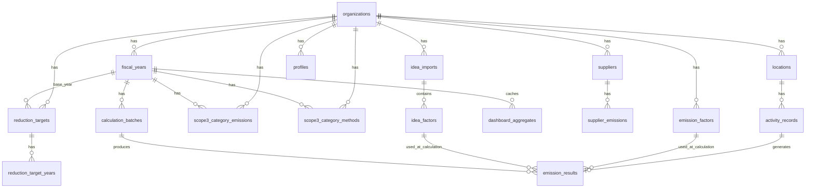

# GreenTrack 機能仕様書

本書は GreenTrack の**現行の機能仕様**（画面・列挙型・バリデーション規則・算定ロジック）を定義する。

関連正本:

| 領域 | 正本 |
|---|---|
| 開発規約・技術スタック | [`AGENTS.md`](../AGENTS.md) |
| アーキテクチャ | [`architecture.md`](./architecture.md) |
| DB 物理設計（全カラム定義） | [`database-design.md`](./database-design.md) |
| 算定ロジックの詳細 | [`calculation-logic.md`](./calculation-logic.md) |
| Scope 3 積上げ（IDEA 連携） | [`idea-scope3-spec.md`](./idea-scope3-spec.md) |

本書はフィールドの全定義を重複して持たない。カラム単位の定義は `database-design.md` を参照すること（DDL の最終正本は `supabase/migrations/*_schema.sql`）。

---

## 1. 目的とスコープ

GreenTrack は、企業の温室効果ガス（GHG）排出量を算定・可視化・管理する Web アプリケーションである。Scope 1 / 2 / 3 を横断し、脱炭素経営の意思決定を支援する。

**想定ユーザー**: 環境推進部門・サステナビリティ担当、拠点のエネルギー管理責任者、経営層。

### 1.1 対応範囲

| 区分 | 対応内容 |
|---|---|
| 認証 | Supabase Auth（メール + パスワード）。招待によるメンバー追加、パスワード再設定。ロールによる権限分岐は持たない（`profiles.role` は残るが参照しない） |
| マルチテナント | `organizations` 単位。全テーブルを RLS で組織スコープに閉じる |
| Scope 1 / 2 | 活動量 × 排出係数で算定。電気・都市ガス・熱・各種燃料に対応 |
| Scope 3 | カテゴリ（1〜15）ごとに **direct（直接入力）** と **calculated（IDEA 原単位の積上げ）** を排他選択（§4.3.3 / §7.2） |
| データ入力 | 手動入力のみ（`SourceType` は `manual` の 1 値）。活動量のファイル取込は持たない |
| 削減目標 | 基準年度 + 年度ごとの削減率（%）。年間目標は「基準年度の実績 × (1 − 削減率/100)」で導出する |
| レポート | PDF（印刷ビュー）と CSV。**社内確認・共有を想定した独自様式であり、制度の提出様式ではない** |

**対象ガスは実質的に CO2 のみ**（同梱の公式係数がすべて CO2 対象。CH4 / N2O / フロン類を入力・算定する仕組みは無い）。Scope 2 のマーケット基準／ロケーション基準の区別、証書・クレジットの反映も未実装。

### 1.2 共通コンテキスト

全画面で以下を前提とする。

| 項目 | フィールド | 説明 |
|---|---|---|
| 組織 | `organizationId` | テナント識別子。RLS で強制される |
| 算定年度 | `fiscalYearId` | ヘッダーで切り替える。表示・集計の基準 |
| 表示単位 | — | t-CO2e 固定 |

**算定年度（`fiscal_years`）**: `label`（例 `2024年度`）、`startDate` / `endDate`。開始月は組織設定（`organizations.fiscalYearStartMonth`）で変更でき、4月始まり以外も選べる。「現在の年度」は DB のフラグではなく**今日の日付が期間に含まれるか**で判定する（`isCurrentFiscalYear`）。画面の既定選択は最新年度（`startDate` 降順の先頭）。

---

## 2. ドメインモデル



図は外部キーのある関係だけを描く。`scope3_category_methods` と `scope3_category_emissions` は `organizationId` + `fiscalYearId` + `categoryId` で突き合わせるが、両者の間に外部キーは無い。

| エンティティ | 説明 |
|---|---|
| `locations` | 拠点マスタ |
| `emission_factors` | 排出係数（公式マスタ・組織カスタム）。`organizationId` が null の行は全組織共通の読み取り専用マスタ |
| `activity_records` | 活動量（電気 kWh、ガス m³ 等）。Scope 3 積上げ行は `energyType='scope3_activity'` |
| `emission_results` | 算定結果（t-CO2e）。`activityRecordId` に UNIQUE 制約（二重計上防止） |
| `calculation_batches` | 算定ジョブ |
| `idea_imports` / `idea_factors` | IDEA データベース由来の Scope 3 原単位。精度・規模・ライセンス境界の都合で `emission_factors` とは別テーブル |
| `scope3_category_emissions` | Scope 3 カテゴリ別の直接入力値 |
| `scope3_category_methods` | カテゴリごとの算定方式（`direct` / `calculated`）の選択状態 |
| `suppliers` / `supplier_emissions` | サプライヤー別の Scope 3 実排出量（1次データ）。表示専用で `scope3Total` には算入しない |
| `reduction_targets` / `reduction_target_years` | 削減目標。組織あたり 1 行の基準年度と、年度ごとの削減率（%） |
| `dashboard_aggregates` | ダッシュボード用の集計キャッシュ |
| `system_audit_logs` | 監査ログ。レポート生成履歴もここに記録する |

---

## 3. 列挙型・マスタ

値は DB の enum 型（`supabase/migrations/*_schema.sql`）と `src/features/calculation/types.ts` が正本。

### 3.1 Scope

`scope1` / `scope2` / `scope3`

### 3.2 エネルギー種別（EnergyType）

**手動入力の選択肢**（`MANUAL_ACTIVITY_CATEGORIES`。単位は種別に連動し編集不可）

| 値 | 表示名 | 単位 |
|---|---|---|
| `electricity` | 電気 | kWh |
| `city_gas` | ガス | m³ |
| `heat` | 熱（温水・冷水・蒸気） | GJ |
| `waste` | 廃棄物 | t |
| `fuel` | 燃料 | L |
| `business_travel` | 出張 | 人・日 |
| `business_travel_commuting` | 通勤 | 人・日 |

出張（Scope 3 カテゴリ6）と通勤（カテゴリ7）は別カテゴリ。係数候補は energyType の完全一致で絞るため、1 本にまとめると通勤の係数だけが候補になり、出張の代表原単位（12 件）に到達できない（#381）。

`business_travel_commuting` の単位が距離（km）でなく延べ人日なのは、公式係数（環境省 排出原単位DB カテゴリ7 通勤）がすべて `kg-CO2/人・日` のため。km で保存すると換算できず恒久的に `UNIT_MISMATCH` になる。`business_travel` も標準単位は延べ人日（公式係数「延べ出張日数当たり」`t-CO2/人・日`）だが、交通費支給額当たり（`kg-CO2/円`）・宿泊数当たり（`kg-CO2/泊`）・従業員当たり（`t-CO2/人・年`）の係数を選ぶと、入力フォームが係数の分母単位（円 / 泊 / 人・年）で活動量を入力させる（`resolveEntryUnit`）。

**手動入力の選択肢外**（ラベルのみ保持。登録済みレコードの履歴表示と、排出係数管理の種別表示に使う）

公式係数が 1 件も無く、選んでも未算定のままになる 4 種:
`vehicle`（車両 km） `logistics`（物流 t-km） `purchased_goods_services`（購入した製品・サービス 円） `supplier_data`（サプライヤーデータ t-CO2e）

> 物流・購入した製品・サービスは IDEA 原単位（Scope 3 積上げ）から入力する。車両は燃料（L）で入力する（距離ベースの推計は燃料との二重計上の入口になるため）。

その他:
`fuel_heavy_oil`（重油 L） `fuel_diesel`（軽油 L） `water`（水道 m3） `freight_transport`（輸送 t-km）

温対法「算定方法・排出係数一覧」の主要燃料:
`fuel_gasoline`（ガソリン L） `fuel_kerosene`（灯油 L） `fuel_crude_oil`（原油 L） `fuel_naphtha`（ナフサ L） `fuel_jet`（ジェット燃料油 L） `fuel_lpg`（LPG t） `fuel_lng`（LNG t） `fuel_natural_gas`（天然ガス m³） `fuel_coal`（石炭 t）

**Scope 3 積上げ専用**

`scope3_activity` — IDEA 連携の積上げレコード。カテゴリ識別は `activity_records.scope3CategoryId` が担う。**係数作成 UI・係数 CSV 取込の種別候補からは除外する**（カスタム係数が積上げ行に自動マッチする経路を塞ぐため）。

### 3.3 算定バッチステータス（BatchStatus）

`pending`（実行中） / `completed`（完了） / `failed`（失敗）

`pending` のまま滞留したバッチは、次のバッチ作成時に `failed` へ回収される（プロセス消失で年度の算定が恒久的に止まらないようにするため）。

### 3.4 拠点ステータス（LocationStatus）

`active`（稼働中） / `paused`（一時停止） / `preparing`（準備中） / `closing`（閉鎖予定）

### 3.5 入力元種別（SourceType）

`manual`（手動入力）のみ。活動量のファイル取込は持たないため 1 値だけの enum になっている。

### 3.6 係数ステータス（FactorStatus）

`active`（有効） / `pending_review`（確認中） / `draft`（下書き） / `archived`（アーカイブ済み・一覧非表示）

### 3.7 係数データソース（FactorSource）

`moe`（環境省） / `meti`（経済産業省） / `ketsoho`（温対法） / `utility`（事業者別排出係数） / `custom`（自社設定）

### 3.8 係数種別（FactorType）

`basic`（基礎排出係数） / `adjusted`（調整後排出係数）。区分を持たない係数（燃料・Scope 3 原単位・カスタム係数）は null。

### 3.9 Scope 3 カテゴリ

| ID | 表示名 |
|---|---|
| 1 | 購入した製品・サービス |
| 2 | 資本財 |
| 3 | Scope 1,2 に含まれない燃料及びエネルギー |
| 4 | 輸送、配送（上流） |
| 5 | 事業から出る廃棄物 |
| 6 | 出張 |
| 7 | 雇用者の通勤 |
| 8 | リース資産（上流） |
| 9 | 輸送、配送（下流） |
| 10 | 販売した製品の加工 |
| 11 | 販売した製品の使用 |
| 12 | 販売した製品の廃棄 |
| 13 | リース資産（下流） |
| 14 | フランチャイズ |
| 15 | 投資 |

### 3.10 Scope 3 算定方式（Scope3Method）

`direct`（直接入力） / `calculated`（積上げ）。カテゴリごとに排他選択する。将来 `hybrid` を値追加で拡張可能。

### 3.11 地域（Region）

`Hokkaido`（北海道） `Tohoku`（東北） `Kanto`（関東） `Chubu`（中部） `Kansai`（関西） `Chugoku_Shikoku`（中国・四国） `Kyushu`（九州） `Overseas`（海外）

### 3.12 拠点種別（LocationType）

`headquarters`（本社） `branch`（支社） `factory`（工場） `office`（オフィス） `logistics`（物流拠点） `service`（サービス拠点） `other`（その他）

### 3.13 IDEA 取込ステータス（IdeaImportStatus）

`processing` / `completed` / `failed`

---

## 4. 画面別仕様

| URL | 画面 | 主なデータソース |
|---|---|---|
| `/dashboard` | ダッシュボード | `dashboard_aggregates`、`reduction_targets` |
| `/data-input` | データ入力 | `activity_records`、`emission_factors`、`idea_factors` |
| `/scope-analysis` | Scope 分析 | `scope3_category_methods`、`scope3_category_emissions`、`emission_results`、`supplier_emissions` |
| `/factors` | 排出係数管理 | `emission_factors`、`idea_imports` |
| `/locations` `/locations/[locationId]` | 拠点管理 | `locations` |
| `/reports` `/reports/print` | レポート | 集計 RPC、`system_audit_logs`（履歴） |
| `/settings/company` `/settings/account` | 設定 | `organizations`、`profiles`、`fiscal_years`、`invites` |
| `/login` `/signup` `/forgot-password` `/reset-password` `/invite/[token]` | 認証 | Supabase Auth、`invites` |

### 4.1 ダッシュボード

KPI サマリ（総排出量・Scope 別・前年比）、月別推移（積上げ棒＋削減目標ライン）、Scope 3 内訳（カテゴリ別）、排出量上位拠点、削減目標カード。削減目標は独立した画面を持たず、このカードから設定する（§4.7）。

Scope 3 内訳は排出量の多い順に**上位 5 カテゴリ**を個別表示し、残りは「その他（N カテゴリ）」に束ねる。

排出量上位拠点（Scope 1・2 の合計・上位 5 拠点）は**拠点で絞り込んでいる間は表示しない**。組織全体のランキングであり拠点絞り込みが効かないため、選択拠点の値の横に他拠点の数値が並ぶと絞り込みが効いていないと誤読させるため。Scope 3 内訳・KPI の Scope 3 は拠点別に持てないため、絞り込み中も組織全体の値を「（組織全体）」の注記つきで表示する。

KPI カードの前年比ピルと排出量上位拠点テーブルの前年比列は、**色による良し悪しの断定を年度の終了日を過ぎた年度に限る**（削減目標カードの達成状況・基準年度比と同じ整理、§4.7）。分子が表示年度の期中累計・分母が前年度の通年実績のため、期中は実態より大きな「削減」に見える（期首・未入力なら `↓100.0%`）。期中は増減率と向き（`↑` / `↓`）は出したうえで `（期中）` を添えて中立色にする。前年度のデータが無ければ `前年比データなし`（中立）。

集計は `dashboard_aggregates` を参照する。キャッシュは算定確定時に **絶対値で再計算**（自己修復）される。Scope 3 内訳は**方式適用後の採用値**（direct を選んだカテゴリは direct 値、calculated を選んだカテゴリは積上げ値）に揃える。

### 4.2 データ入力

活動量の入力は**手動入力のみ**（`SourceType` は `manual` の 1 値）。ファイル取込・請求書からの自動抽出は持たない。

#### 4.2.1 統合入力フォーム

1 つのフォームで Scope 1・2 と Scope 3 積上げの両方を入力する。カテゴリの選択で**係数の参照方式**が決まり、フォームの中身が切り替わる。

| 参照方式 | 対象カテゴリ | 係数の決まり方 |
|---|---|---|
| 供給事業者別 | 電気・ガス・熱 | 計算方法（基礎/調整後）→ 供給事業者 → メニュー を選ぶ。未選択なら全国の代替値 |
| 標準 | 廃棄物・燃料・出張・通勤 | 拠点・対象年月に合う標準係数を優先順位で自動選択。候補から変更も可 |
| IDEA 原単位 | Scope 3 カテゴリ 1〜15 | 製品をサーバーサイド検索で選ぶ。単位は製品から自動設定（編集不可） |

入力項目は 拠点・カテゴリ・使用量・単位（種別に連動し編集不可）・対象年月・備考。保存前に、**保存後の算定で実際に適用される係数**でインライン概算排出量を表示する（同じ純関数を使うため、プレビューと算定結果はずれない）。

適用係数が決まらない場合は、その理由を入力欄の直下で知らせ、プレビューと保存を止める。

| 状態 | 案内 |
|---|---|
| 候補なし | この条件に適用できる排出係数が見つからない。保存すると未算定として記録される |
| 曖昧（`FACTOR_AMBIGUOUS`） | 同順位の候補が複数あり自動では決められない。候補から選択するよう促す |
| 指定が適用外 | 保存されていた係数が現在の条件では適用できない。事業者別係数なら**同一供給事業者・同一メニュー・同一係数種別の現行年度の係数へ読み替え**、読み替え先が無ければ自動選択の係数で再計算される |

対象年月の年度の公式係数が未公表のときは、直近の過年度の公式係数を**暫定適用**して概算・保存する（§7.3）。係数詳細に「〈年度〉年度の係数を暫定適用」バッジと理由を表示する。新しい年度の係数が登録されると、そのあとに算定するレコードは正式係数で計算されるが、暫定適用のまま算定済みのレコードは自動では切り替わらない（§4.2.3 の再算定導線で明示的に差し戻す）。

#### 4.2.2 入力履歴

登録済みの活動量を一覧・検索・編集・削除する。Scope 3 積上げ行はカテゴリ名と IDEA 製品名も検索対象に含める。

活動量を編集すると `isCalculated = false` へ戻り、**同一トランザクションで旧 `emission_results` が削除される**（トリガー `clear_emission_results_on_recalculation`）。再算定までダッシュボードが旧値を計上し続けることはない。

#### 4.2.3 算定の実行

活動量を保存すると自動算定が走る（`POST /api/calculations`）。算定確定とダッシュボード集計は **`run_calculation_commit` RPC が単一トランザクション**で実施する（EXECUTE は `service_role` 限定）。レート制限（429）で弾かれた年度は持ち越し、自動で再試行する。再試行が上限に達したら手動の再計算導線へ案内する。

入力履歴に未算定レコード（`isCalculated = false`）があるときは「未算定分を再計算」ボタン（自動再試行の待機中は「今すぐ再計算」）を出す。対象は当年度に限らず、**未算定レコードの対象期間が属するすべての算定年度**。対象期間に算定年度が未登録のレコードは算定できず、年度の登録を案内する。

未公表年度の暫定適用（§7.3）で算定したデータは、正式係数が投入されても算定バッチ（未算定レコードのみ処理）では置き換わらない。そのため入力履歴に「正式な排出係数が公表される前に暫定適用で算定したデータ」が残っているときは、対象年度と件数を示すバナーと「正式係数で再算定」ボタンを出す。押すと該当レコードだけを `isCalculated = false` へ戻し（`POST /api/calculations/provisional-recalculation`）、続けて通常の算定を実行する。

算定後はトーストで結果を件数で提示する: 算定した件数と合計排出量、未算定の理由別件数（§5.5）、**明示指定どおりに算定できなかった件数**（読み替え・フォールバック）、算定年度が未登録の件数、失敗、レート制限による持ち越し。読み替え・フォールバックは算定自体が成立して値が出るぶん気づきにくいため、成功時でも件数を知らせ、入力履歴から該当レコードを開いて適用された係数を確認するよう促す（`CalculationOutcome.warnings`。詳細は [`calculation-logic.md`](./calculation-logic.md) の「明示指定」）。

### 4.3 Scope 分析

#### 4.3.1 カテゴリ別排出

カテゴリ 1〜15 の排出量・構成比を表示する。

#### 4.3.2 サプライヤー別排出

`supplier_emissions` の実排出量（1次データ）を**按分せずそのまま**排出量降順で表示する。**表示専用であり `scope3Total` には算入しない**。

#### 4.3.3 Scope 3 の入力方式

カテゴリごとに `direct`（直接入力）と `calculated`（IDEA 原単位の積上げ）を**排他選択**する。方式は `scope3_category_methods` が保持する（画面上の呼称は「算定方法」）。

| 方式 | 値の出どころ |
|---|---|
| `direct` | `scope3_category_emissions` にカテゴリ別 t-CO2e を直接登録する |
| `calculated` | `energyType='scope3_activity'` の活動量レコードを IDEA 原単位で積み上げた `emission_results` |

`direct` 値の登録・編集は **Scope 分析画面の「カテゴリ別の算定方法」テーブルの編集モーダル**から行う（`scope3_category_emissions` への upsert → 再集計 → 再取得）。積上げを採用中のカテゴリでも直接入力値は「未採用」として保持される。

方式が排他であるため、**direct 値と積上げ値が同一カテゴリで二重計上されることは構造的にない**。

画面はクエリ `?fy=<会計年度ID>` を受け付け、登録済みの年度に一致すれば開いたときに選択年度へ適用する（一致しなければ無視して既定の最新年度）。データ入力画面の direct 方式注記の導線はこのクエリで記録の帰属年度を運ぶ。選択年度はタブ内の状態で永続化されないため、新しいタブで開いても文言どおりの年度で開く。

### 4.4 排出係数管理

公式係数マスタ（`organizationId` が null）と組織のカスタム係数を一覧・検索する。カスタム係数の新規登録・更新、**係数 CSV の取込・書き出し**、標準係数ソースの出典表示、IDEA データベース（Excel）の取込に対応する。

一覧は係数の性質で **2 つのタブ**に分かれる（`src/features/factors/utils/factorGroups.ts` が正本）。

| タブ | 中身 | 種別を選ぶ軸の呼び名 |
|---|---|---|
| エネルギー・燃料係数 | 物理量（kWh・L・m³ 等）あたりの係数。電気・ガス・熱・各種燃料 | エネルギー種別 |
| Scope 3 活動係数 | 活動量（円・t-km・人・日 等）あたりの係数。水道・輸送・出張・通勤・廃棄物・購入した製品・サービス等 | 活動カテゴリ |

振り分けは**エネルギー種別ラベルから決める**（`scope` 列ではない）。燃料は Scope 3 カテゴリ3（Scope 1,2 に含まれない燃料及びエネルギー）にも現れるため、`scope` で切ると同じ燃料が 2 つのタブに分かれてしまうため。DB 変更は不要。

絞り込み・列見出し・追加フォームの表記はタブに追従し、フォームの種別候補も同じ 2 群の `optgroup` にまとめる。CSV の列見出しは既存テンプレートとの互換のため「エネルギー種別」のまま据え置く（取込のヘッダー検証と一致させるため）。書き出しは**表示中のタブと絞り込み条件**の係数を対象にする。

係数 CSV の取込は、書き出した CSV をそのまま取り込める（ラウンドトリップ）。標準係数と同じキーで値を変えた行は「カスタム係数として新規追加」し（カスタムは標準より優先されるため上書きとして機能する）、同じキーのカスタム上書きが既にあればそれを更新する。事業者別係数は上書き対象外（1 事業者の係数を直したつもりが組織全体の係数を差し替えてしまうため）。

`providerName` が非 null の係数（事業者別係数・IDEA 正規化行）は**自動解決の対象外で、明示選択専用**（§7.3）。

### 4.5 拠点管理

拠点の登録・編集・削除、CSV の取込・書き出し、地域別分布、拠点種別構成、拠点詳細。

拠点は `name` / `region` / `type` / `managerName` / `status` を持つ。`name` は必須、`name` と `managerName` は 100 文字以内（V-LOC-001 / V-LOC-002。フォームと CSV 取込で共通）。

`locations` テーブルの `scopes` / `prefecture` / `address` / `isAggregationTarget` / `managerUserId` 列はアプリから読み書きしない（画面・CSV・算定のどこにも効かないため型からも外している。列は据え置き）。

### 4.6 レポート

| 形式 | 生成方法 |
|---|---|
| PDF | 印刷用ビュー（`/reports/print`）+ `window.print()`。用紙・ページ分割・配色を CSS で制御 |
| CSV | クライアント側で生成（Excel で開ける） |

新規ライブラリを追加せずに xlsx を生成できないため、表計算向けは CSV に統一している。生成履歴は `system_audit_logs` に記録し、履歴からの再ダウンロード（CSV は条件から再生成、PDF は印刷ビュー再表示）に対応する。

| 種別 | 内容 | 拠点選択 |
|---|---|---|
| 年度温室効果ガス排出サマリ | 年度別 Scope 1/2/3 合計と構成比、対象拠点別の Scope 1・2 | 使う |
| Scope 3 カテゴリ別詳細分析 | カテゴリ別内訳・主要サプライヤー・算定方法（IDEA 引用表記つき） | 使わない（組織全体） |
| 拠点別排出量・エネルギー内訳 | 拠点別 Scope 1・2 とエネルギー種別使用量 | 使う |

全種別に**データ充足状況**セクションを載せる。未算定レコードは `emission_results` を持たずレポートの集計値にも現れないため、算定済み／未算定の件数と充足率を本文に出し、「集計できた分の合計」を全体の排出量と誤認させないようにする。充足率は件数ベースであり、欠落している排出量の規模を表すものではない（システムに未入力のデータは検知できない）。

Scope 1・2 は選択拠点、Scope 3 は組織全体という集計範囲の違いがあるため、年次サマリの充足状況も同じ範囲で数える（Scope 3 積上げ明細は拠点で絞らない）。

充足状況は「レポートの排出量に採用され得るレコード」だけを数える。算定バッチは方式に関係なく未算定レコードを全件算定するため、算定方法が**直接入力**のカテゴリに属する Scope 3 の活動量（標準係数の廃棄物・出張・通勤ほかと IDEA 積上げ明細の両方）も「算定済み」になるが、その値はカテゴリの採用値（方式別集計）に入らない。これらを分母・分子に含めると「充足率100%だが1件も反映されていない」と読める表になるため、件数・充足率からは外し、除外件数だけを注記に出す。IDEA 積上げ明細はカテゴリがレコードごとに違うため、`report_scope3_activity_calculation_coverage` でカテゴリ × 方式の粒度で数える。

出力前に、レポート画面の**出力内容のプレビュー**で現在の選択（種類・拠点・年度）でレポートに載る合計を示す。合計の直下に「選択拠点 Scope 1・2 + 組織全体 Scope 3」の内訳を明示し、拠点を絞っても Scope 3 は組織全体の値が載ることを誤読させない。算定バッチの状態（§3.3）が `completed` のときは完了時刻だけを控えめに出し、`pending` / `failed` / 記録なしのときは警告スタイルで「レポートに何が載るか」を説明する。

**社内での確認・共有を想定した独自様式であり、制度の提出様式ではない。**

### 4.7 削減目標

**基準年度 + 年度ごとの削減率（%）** で持つ。ある年度の年間目標排出量は「基準年度の実績 × (1 − その年度の削減率 / 100)」として導出する。

| テーブル | 内容 |
|---|---|
| `reduction_targets` | 組織あたり 1 行。基準年度（`baseFiscalYearId`）を持つ |
| `reduction_target_years` | 年度（`targetYear`）ごとの削減率。`0` = 現状維持、`100` = ゼロ排出 |

削減率を入力できる年度は**基準年度の翌年度 〜 現在の年度 + 5 年**（`TARGET_YEARS_AHEAD`）。基準年度そのものは定義上 0% のため含めない。「現在の年度」は今日の日付と組織の期首月から導出し、保存しない（毎年ずれる）。

削減率が入っていない年度は「目標未設定」として扱い、チャート上の目標線を省略する。専用画面は持たず、ダッシュボードの削減目標カードから設定する。

基準年度の実績（＝目標排出量の分母）は保存せず、表示のたびに引き直す。そのため**まだ終了していない年度（期中・未来）を基準年度にすると、月々の入力で分母が増え、設定を変えないまま各年度の目標排出量が動く**。初期セットアップ直後の組織は期中の年度しか持たず、選択を禁じると目標を一切設定できなくなるため、選択は許したうえで注意書きを出す（設定モーダルの基準年度セレクタの下、実績プレビューの `（期中の累計）`、カードの基準年度排出量の注記）。

カードには基準年度排出量・年間目標・年間実績（累計）・**目標消化率**を表示する。

| 表示 | 内容 |
|---|---|
| 目標消化率 | 年間実績（累計） ÷ 年間目標 × 100。削減目標は排出量の上限なので**低いほど順調、100% 超で超過**。一般的な「達成率」（100% に近いほど良い）とは向きが逆のため「達成率」とは呼ばず、注記「目標に対して使った排出量の割合（低いほど順調）」を添える。目標未設定・目標 0（ネットゼロ）は「—」 |
| 残り枠 | 年間目標 − 年間実績（t-CO2e）。進捗バーの下に率とあわせて出す。超過時は超過量を出す |
| 達成状況 | 判定は「年間実績（累計） ≤ 年間目標」。分子が累計・分母が通年目標のため期中は断定せず「枠内で推移中」／「目標超過」と表示し、「達成」／「未達」は年度の終了日を過ぎた年度に限る |
| 基準年度比（実績） | 年間実績（累計）の注記に、目標側の「基準年度比 ◯% 削減」と同じ物差しで実績の増減率を併記する（削減は `▲`、増加は `+`、小数第 1 位。丸めて 0 は `±0.0%`）。色による良し悪しの断定は**年度の終了日を過ぎた年度に限る**（達成状況と同じ整理）。分子が期中累計・分母が基準年度の通年実績のため、期中は実態より大きな削減に見える（期首・未入力なら `▲100.0%`）ので、`（期中）` を添えて中立色にする。**基準年度より前の年度**は削減パスの対象外のため、増減率は出すが評価色は付けない。表示年度が基準年度そのものなら増減率の代わりに基準年度である旨を示し、基準年度の実績が 0 で分母にできない場合は `—` |

### 4.8 設定

**組織設定**: 組織情報、算定年度（開始月を含む）の管理、メンバー一覧と招待。
**アカウント設定**: プロフィール、パスワード変更、アカウント削除。

---

## 5. バリデーション規則

### 5.1 共通

| ルール ID | 条件 |
|---|---|
| V-COM-001 | 組織スコープは RLS で強制する。サーバ側で `service_role` を使う経路では Route Handler が組織所属を明示検証する |
| V-COM-002 | `fiscalYearId` が組織に属すること |
| V-COM-004 | 活動量は正数（V-ACT-001）。DB の精度は `activity_records.amount` `numeric(15,3)`、`emission_results.emissions` `numeric(15,6)`、`emission_factors.factorValue` `numeric(12,6)` |

### 5.2 拠点（Location）

| ルール ID | 条件 | メッセージ（例） |
|---|---|---|
| V-LOC-001 | `name` 必須・100 文字以内（`varchar(100)`。超えると DB の汎用エラーになるため入力段階で弾く） | 拠点名が空欄です / 拠点名は100文字以内で入力してください |
| V-LOC-002 | `managerName` 100 文字以内 | 担当者は100文字以内で入力してください |
| V-LOC-004 | 削除時、**未算定の `ActivityRecord`（`isCalculated = false`）が 1 件でも残る拠点は削除不可** | 未処理の入力データがあるため削除できません |
| V-LOC-005 | Scope 3 積上げレコード（`energyType='scope3_activity'`）を持つ拠点は削除不可。明細の移動または削除を案内する | — |

> V-LOC-005 の理由: `emission_results` が `locationId` を CASCADE 参照しており、拠点削除で積上げ算定結果が黙って消えるため。

### 5.3 活動量

| ルール ID | 条件 | メッセージ（例） |
|---|---|---|
| V-ACT-001 | `amount` > 0（半角数字と小数点のみ） | 活動量は0より大きい半角数字で入力してください |
| V-ACT-002 | 対象年月（年・月の選択）から `periodStart`（月初）/ `periodEnd`（月末）を導出する。2000年1月以降。**未来月は登録不可**（編集で年月を変えない場合のみ、既存の未来月レコードを保存できる） | 未来の対象年月は登録できません。当月以前を選択してください |
| V-ACT-003 | 対象期間が算定年度に含まれなくても保存はできるが算定されない。年度を登録した後に再計算できる（§4.2.3） | N件は対象期間の算定年度が未登録のため、まだ排出量が計算されていません |
| V-ACT-004 | `locationId` 必須 | 拠点を選択してください |
| V-ACT-005 | `unit` は入力しない。種別の標準単位（§3.2）または選択した IDEA 製品の単位を自動設定する（編集不可） | — |
| V-ACT-006 | 重複禁止キー: 拠点 × エネルギー種別 × 対象月。Scope 3 積上げは 拠点 × `scope3_activity` × 対象月 × カテゴリ × IDEA 製品。重複したレコードの拠点名・カテゴリ・製品名を含めて案内し、既存レコードへの合算を促す | 同じ拠点・カテゴリ・対象年月の活動量が既に登録済みです |
| V-ACT-007 | `amount` は整数部 12 桁以内・小数部 3 桁以内（`numeric(15,3)`。超えると overflow の汎用エラー、または 0.000 への丸めになるため保存前に弾く） | 活動量は整数部12桁以内で入力してください / 活動量は小数第3位までで入力してください |
| V-ACT-008 | 備考 500 文字以内 | 備考は500文字以内で入力してください |

> V-ACT-006 の Scope 3 積上げで IDEA 製品までキーに含める理由: エネルギー種別のみのキーだと、推奨粒度「月次 × 製品」の 2 製品目が登録できなくなるため。

検証順序は 拠点 → 対象年月 → （IDEA: 製品）→ 活動量（> 0・桁数）→ 備考 で、最初のエラーだけを返す（`validateEntry`）。

### 5.4 排出係数

| ルール ID | 条件 | メッセージ（例） |
|---|---|---|
| V-FAC-001 | `name` 必須 | 係数名を入力してください |
| V-FAC-002 | 組織のカスタム係数は同一キー（年度 + エネルギー種別 + 地域 + scope。拠点固有係数は + 拠点）で `active` は 1 件。DB の部分ユニークインデックスで担保する | 同条件の有効係数が既に存在します |
| V-FAC-003 | `factorValue` はフォームの入力制約で 0 以上（`min="0"`）。DB に CHECK 制約は無い | — |
| V-FAC-004 | 公式係数（`organizationId` が null）は読み取り専用。RLS で組織からは更新できず、画面でも編集を止める | 標準係数は画面から直接編集できません |
| V-FAC-005 | `scope` はエネルギー種別から一意に決まり、入力値では選べない（`calculation/engine/energyTypeScope.ts`）。フォームは種別に応じて自動表示し、保存直前の変換も種別から決め直す。CSV 取込は食い違う行を取り込まない | 適用範囲「Scope 1」はエネルギー種別「廃棄物」と一致しません（Scope 3） |

### 5.5 算定（Calculation）

| ルール ID | 条件 | メッセージ（例） |
|---|---|---|
| V-CAL-001 | 活動量に適用可能な `active` 係数が存在すること（対象年度の公式係数が未公表なら直近の過年度を暫定適用する。§7.3） | 適用できる排出係数が見つからず未算定のままです |
| V-CAL-002 | 算定式: `emissions = amount × factorValue`（単位換算後） | （内部エラー） |
| V-CAL-003 | 係数解決は §7.3 の優先順位に従う | — |
| V-CAL-004 | 同順位の候補が複数あり名称が異なる場合は自動で決めず未算定にする | 該当する排出係数が複数あり自動では決められません |
| V-CAL-006 | Scope 3 積上げで `ideaFactorId` が null のレコードは参照切れの孤児として `SCOPE3_FACTOR_MISSING` で未解決にする | — |

**未算定の理由**（`UnresolvedReason`）は次の 4 つ。いずれも**暗黙に 0 として集計しない**で未算定のまま残し、件数を画面とレポートに出す。

| 理由 | 意味 |
|---|---|
| `FACTOR_NOT_FOUND` | 適用できる係数が無い（暫定適用の範囲を超えて古い係数しか無い場合を含む） |
| `FACTOR_AMBIGUOUS` | 同順位の候補が複数あり名称が異なる（例: `fuel_heavy_oil` の「A重油」「B・C重油」）。当てずっぽうで選ばず、入力フォームでの係数選択を促す |
| `UNIT_MISMATCH` | 活動量の単位を係数の単位へ換算できない |
| `SCOPE3_FACTOR_MISSING` | 参照していた IDEA 係数が無い |

**単位換算**: 活動量の単位と係数の単位が一致しない場合は、換算テーブル（`kWh` ↔ `MWh` 等）を**サーバー側で適用**する。次元が異なる／未知の単位／分子が CO2e 系でない／係数が単位形式でない場合は換算不能とする。

自動解決では、優先順位で並べた候補のうち**活動量の単位から換算できる係数**だけを採用対象にする。ただし単位互換を見るのは**最上位の優先度段階の中だけ**で、上位段階（拠点カスタム等）が全滅しても下位段階へは落ちない（組織が意図して登録した係数を黙って差し替えないため）。

### 5.6 サプライヤー

| ルール ID | 条件 |
|---|---|
| V-SUP-001 | `primaryDataRate` 0〜100 |
| V-SUP-002 | `categoryId` 1〜15 |

---

## 6. データアクセスと API

### 6.1 方針

自前の API サーバや ORM は持たず、バックエンド機能はすべて Supabase に寄せる（[`architecture.md`](./architecture.md)）。

| 経路 | 用途 |
|---|---|
| **Supabase クライアント直接** | 画面の大半の読み書き。RLS が組織スコープを強制する |
| **Postgres RPC** | 複数テーブルにまたがる原子的な更新・集計（全行取得を避けるため DB 側で集計する） |
| **Next.js Route Handler** | `service_role` やネイティブモジュールが必要な処理に限る |

**REST の汎用 API は提供していない。** 外部システム連携用の公開 API は現時点で存在しない。

### 6.2 Route Handler 一覧

| メソッド | パス | 説明 |
|---|---|---|
| POST | `/api/calculations` | GHG 算定バッチの実行トリガー |
| GET | `/api/calculations/provisional-recalculation` | 暫定適用のまま残っている算定済みデータの年度・件数 |
| POST | `/api/calculations/provisional-recalculation` | 同レコードを再算定対象（`isCalculated = false`）へ差し戻し |
| POST | `/api/idea-imports` | IDEA データベース（Excel）の取込 |
| DELETE | `/api/idea-imports/[id]` | IDEA 取込の削除（取込状態の取得は Supabase クライアントから直接読む） |
| POST | `/api/dashboard-aggregates/refresh` | ダッシュボード集計の再計算 |
| POST | `/api/account/delete` | アカウント削除 |
| GET | `/api/health` | ヘルスチェック |
| POST | `/api/csp-report` | CSP 違反レポートの受信 |
| GET | `/auth/callback` | Supabase Auth のコールバック |

`/api/calculations`・`/api/calculations/provisional-recalculation`・`/api/dashboard-aggregates/refresh`・`/api/idea-imports`・`/api/idea-imports/[id]`・`/api/account/delete` の 6 本は `service_role` で RLS を越えて読み書きするため、Route Handler 側でログイン済み・自組織であることを検証する。この組織チェックは RLS では効かず、ここでしか担保できない。`/api/health` も `service_role` を使うが `organizations` を 1 行読む疎通確認のみで、組織データは返さない。

### 6.3 主要な RPC

| RPC | 説明 |
|---|---|
| `run_calculation_commit` | 算定確定 + ダッシュボード集計を単一トランザクションで実施。集計は絶対値再計算（自己修復）。EXECUTE は `service_role` 限定 |
| `refresh_dashboard_aggregates` | ダッシュボード集計のみを再計算 |
| `create_calculation_batch_with_rate_limit` | バッチ作成とレート制限判定を組織単位の advisory lock 内で原子的に行う。滞留した `pending` は先に `failed` へ回収する |
| `complete_idea_import` / `delete_idea_import` | IDEA 取込の完了処理・削除 |
| `dashboard_monthly_emissions` / `dashboard_location_emissions` / `dashboard_location_emissions_by_scope` / `dashboard_scope3_category_emissions` | ダッシュボードの読取集計 |
| `report_location_scope_emissions` / `report_location_energy_usage` / `report_latest_calculation_batches` / `report_activity_calculation_coverage` / `report_scope3_activity_calculation_coverage` | レポートの読取集計 |

読取系を RPC にしているのは、活動量や算定結果を全行ブラウザへ取得しないため（PostgREST の `max_rows` で黙って切り詰められると、集計が静かに欠ける）。

### 6.4 サーバ専用モジュールの分離

`service_role` キーやネイティブモジュール（exceljs）を使うモジュールは、Route Handler からのみ import する（`AGENTS.md` R7）。

> ⚠️ RLS を越える経路では、Route Handler での組織チェックを消さないこと。

### 6.5 ホスティング上の制約

IDEA データベース取込（`POST /api/idea-imports`）は数十MBの Excel をアップロードするため、**リクエストボディ制限のあるホスティング（Vercel の 4.5MB 等）では動作しない**。セルフホスト（またはボディ制限・メモリを設定できる環境）を前提とする。

---

## 7. 算定ロジック

詳細は [`calculation-logic.md`](./calculation-logic.md) が正本。本節は概要のみ。

### 7.1 Scope 1 / 2（活動量ベース）

```
排出量 (t-CO2e) = 活動量 × 排出係数（単位換算後）
```

| Scope | 活動量例 | 係数例 |
|---|---|---|
| Scope 1 | 都市ガス m³ | 温対法 0.00229 t-CO2e/m³ |
| Scope 2 | 電気 kWh | 調整後 0.000438 t-CO2e/kWh |

算定コアは純粋関数（`computeEmissions` / `resolveEmissionFactor`）として I/O 層と分離する。

> Scope 2 の**マーケット基準／ロケーション基準の区別は未実装**。同梱の公式係数は **CO2 のみ**を対象とする（CH4 / N2O / フロン類は未対応）。単位換算は `t-CO2` 系の分子を `t-CO2e` へ 1:1 で読み替える実装であり、他ガスの寄与はゼロとして扱われる。

### 7.2 Scope 3

カテゴリごとに §4.3.3 の方式で採用値が決まる。

| 方式 | 算定 |
|---|---|
| `direct` | `scope3_category_emissions` の登録値をそのまま採用 |
| `calculated` | `energyType='scope3_activity'` の活動量 × IDEA 原単位を積み上げる |

方式が排他のため二重計上は構造的に起きない。

公式係数マスタには `scope='scope3'` の標準係数（廃棄物・輸送・出張・通勤）も入っており、手動入力の「標準係数」群（廃棄物・出張通勤）はこれで算定する。係数取得は scope で絞らず、`computeEmissions` が係数の `scope` が `scope3` のときエネルギー種別から `categoryId` を補う（`categoryId` が無いと `refresh_dashboard_aggregates` の集計対象にならないため必須）。

**GWP モデル**の既定は **IPCC 2021 (AR6) GWP 100a without LULUCF**。根拠は SSBJ 基準（ISSB S2 踏襲）が「最新の IPCC 評価報告書に基づく 100 年 GWP」を要求しているため。IDEA 取込画面で他モデルも選択でき、選択したモデル名は取込記録に保存してレポート出典欄に表示する。

**丸め**: 積上げでは小口レコードが 0 に落ちて系統的に過小計上されるのを避けるため、`emission_results.emissions` は `numeric(15,6)`（小数第6位）で保持する。

### 7.3 排出係数の解決優先順位（V-CAL-003）

算定時、`energyType` と適用年度（後述）が合う `active` 係数のうち、以下の順で**最初にヒットした係数**を採用する。

| 優先度 | 条件 |
|---|---|
| 1 | 拠点固有のカスタム係数（`isCustom = true` かつ `locationId` 一致） |
| 2 | サプライヤー固有のカスタム係数（`isCustom = true` かつ `supplierId` 一致）— **現行では該当なし**。`activity_records` にサプライヤー紐付けが無く突き合わせられないため、`supplierId` 付きのカスタム係数は自動解決の対象外（`tierOf = Infinity`）。段階番号は将来の復活に備えて予約している |
| 3 | 組織全体のカスタム係数（`isCustom = true` かつ `locationId` / `supplierId` が NULL） |
| 4 | 地域が一致する標準係数（`isCustom = false` かつ 該当 `regionName`） |
| 5 | 全国平均の標準係数（`isCustom = false` かつ `regionName` = `全国`） |

事業者別標準係数（`source = 'utility'`）は、実データ上は地域名で区別されるため優先度 4 に包含される。

**同一優先度内のタイブレーク**として `factorType = 'adjusted'`（調整後排出係数）を優先する（温対法の報告実務では調整後を用いるのが通例）。

**同一優先度内の並び順**は、`factorType='adjusted'` 優先 → 算定年度の開始年と一致する `applicableYear` を優先 → `id` 昇順（DB の行返却順に依存させず再算定で結果が変わらないようにするため）。

**自動解決から除外されるもの**: `providerName` が非 null の係数（事業者別係数・IDEA 正規化行）は `tierOf = Infinity` とし、**明示選択専用**とする。手動入力などで明示選択された `emissionFactorId` が前提フィルタを満たせば、優先順位より優先して使う。

**当てずっぽうを避ける**: 先頭候補と同じ優先度・同じ並び順キーの候補が複数あり、かつ名称が異なる場合は自動で決めず `FACTOR_AMBIGUOUS` として未算定にする。名称まで同じ候補（同名の重複登録）は `id` 順で決めても結果が変わらないため曖昧としない。

**適用年度の突き合わせ**は「算定年度の開始年」と「対象期間開始日の温対法年度（4月〜翌3月）」のどちらかに一致すればよい。組織の算定年度は 4 月始まりとは限らず、公式係数は温対法年度＋有効期間で、有効期間を持たないカスタム係数は算定年度の開始年で登録されるため。

**未公表年度の暫定適用**: 対象年度に公式係数（`isCustom = false`・`active`）が 1 件も無い `energyType` に限り、直近 1 年度（`PROVISIONAL_FALLBACK_YEARS`）の過年度の公式係数を候補に**追加**する（年度を差し替えるのではなく足すだけなので、既に解決できている係数が外れることはない）。2 年度以上前には遡らず `FACTOR_NOT_FOUND` で未算定にする。カスタム係数は暫定適用しない（年度完全一致のみ。「公表済みか」の判定にも数えない）。暫定適用した係数には有効期間（`effectiveTo`）の判定を行わない。算定結果に印は付かないが、入力フォームでは `isProvisionalFactor` で「〈年度〉年度の係数を暫定適用」と表示する（§4.2.1）。

詳細は [`calculation-logic.md`](./calculation-logic.md)。

### 7.4 ダッシュボード集計

| タイミング | 処理 |
|---|---|
| 算定確定時（`run_calculation_commit`） | `emission_results` を集計し `dashboard_aggregates` を更新 |
| Scope 3 の direct 値・方式変更時 | 該当年度の集計を再計算（`POST /api/dashboard-aggregates/refresh`） |
| 活動量レコードの削除時 | 該当年度の集計を再計算（同上）。算定バッチは起こさない（レート制限で 429 になると削除済みの排出量が残るため） |
| 拠点の削除時 | 連鎖削除される算定結果の年度を削除前に控え、年度ごとに集計を再計算（同上） |
| 画面表示 | `dashboard_aggregates` を参照 |

集計は差分加算ではなく**絶対値の再計算**とし、途中でずれても次回の算定で自己修復する。

---

## 8. 画面 ↔ データソース対応

| 画面 | 参照 | 主な更新経路 |
|---|---|---|
| ダッシュボード | `dashboard_aggregates`, `reduction_targets`, `reduction_target_years`, 集計 RPC | 削減目標の設定 |
| データ入力 | `activity_records`, `emission_factors`, `idea_factors` | 手動入力 / `POST /api/calculations` |
| Scope 分析 | `scope3_category_methods`, `scope3_category_emissions`, `emission_results`, `supplier_emissions` | 方式切替、direct 値の upsert |
| 排出係数管理 | `emission_factors`, `idea_imports`, `idea_factors` | カスタム係数 CRUD、係数 CSV 取込・書き出し、`POST /api/idea-imports` |
| 拠点管理 | `locations` | 拠点 CRUD、CSV 取込・書き出し（削除は V-LOC-004 / V-LOC-005 のガードあり） |
| レポート | 集計 RPC, `system_audit_logs` | クライアント生成（PDF 印刷ビュー / CSV） |
| 設定 | `organizations`, `profiles`, `fiscal_years`, `invites` | 組織情報・算定年度・招待の管理 |
